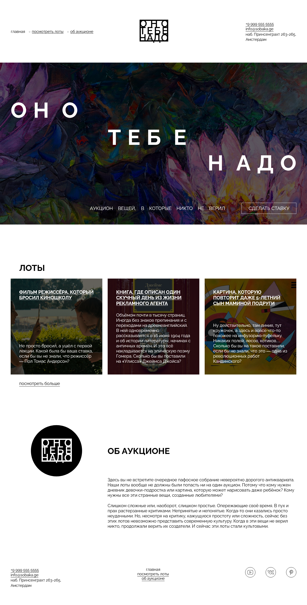

https://github.com/Murka69/ono-tebe-nado

# 📌 Проект «Оно тебе надо»

## Описание

**«Оно тебе надо»** — мини-проект, реализованный с нуля. Основной акцент сделан на создании чистой и структурированной вёрстки по современным стандартам. Целью проекта было закрепить навыки семантической верстки, адаптивности и кроссбраузерности.

Макет: [Figma](https://www.figma.com/design/Kzom0ki2lMMU6zRdSHK9w3/Оно-тебе-надо--1-?node-id=0-1&p=f&t=F0x0BKKF0R96Y9cu-0)

---

## 💡 Использованные технологии

- **HTML5** — для создания логической и понятной структуры страницы.
- **CSS3** — для стилизации интерфейса и реализации адаптивного дизайна (медиазапросы, Flexbox, относительные единицы измерения).

---

## 🎯 Особенности проекта

✔️ Семантическая верстка с использованием правильных тегов (`<header>`, `<main>`, `<section>`, `<footer>` и др.)  
✔️ Адаптивный дизайн под все типы устройств: от мобильных телефонов до десктопов  
✔️ Кроссбраузерность: проверена совместимость в Chrome, Firefox, Safari, Edge  
✔️ Чистый и понятный код без использования фреймворков

---

## 🛠 Как запустить проект локально

1. Склонируйте репозиторий:
   ```bash
   git clone https://github.com/ ваше-имя/ono-tebe-nado.git
   ```
2. Перейдите в папку проекта:

   ```bash
    cd ono-tebe-nado
   ```

3. Откройте файл `index.html` в браузере — сайт готов к просмотру!

---

## Предварительный просмотр


